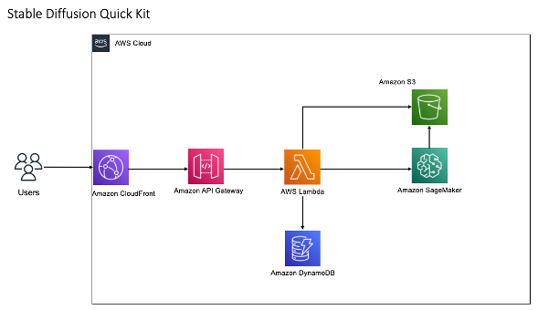

## SageMaker Stable Diffusion Quick Kit

SageMaker Stable Diffusion Quick Kit is an asset to help our customers launch stable diffusion models services on Amazon Sagemaker or Amazon EKS.

**This project  include :** 

* Huggingface diffusers (StableDiffusionPipeline) migrate to Sagemaker Endpoint 
* Origin Stable diffusion model(ckpt) migrate to SageMaker Endpoint 

* Dreambooth fine tuning  migrate to Sagemaker trainning job 

* Lambda script (inference api)

* A simple UI (temporary name: PingAI )

* SageMaker BYOC Dockerfile

* Workshop gudie doc 

* CDK provisioning script 

  

**Not include:**

* Stable diffusion pre-train model

* Any  public docker image 

  

## Security

See [CONTRIBUTING](CONTRIBUTING.md#security-issue-notifications) for more information.

## License

This library is licensed under the MIT-0 License. See the LICENSE file.

