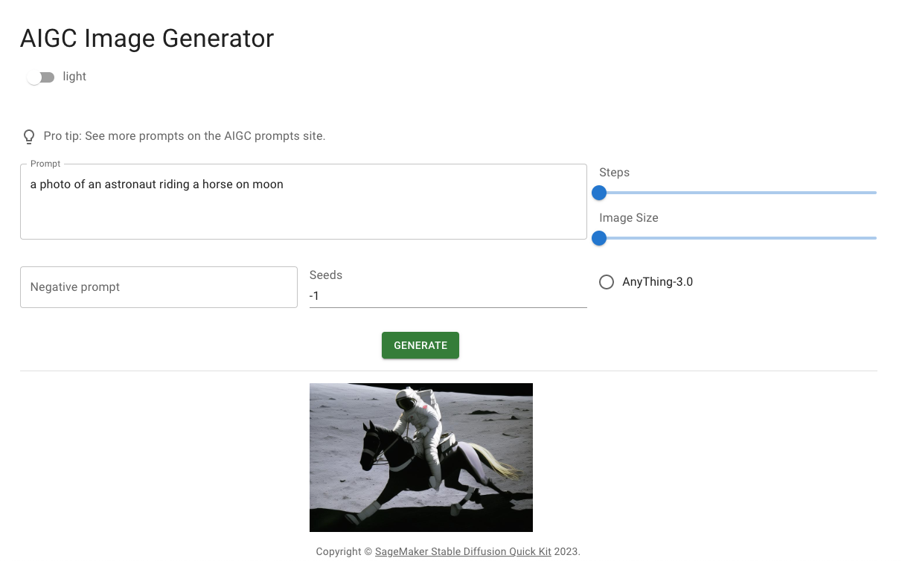

## Deploy Front UI

### 1. Use prebuild package

```bash
 #replace aws_region, aws_accountid, example :  s3://sagemaker-us-east-1-111111111111/aigc/
 #upload build resource to s3 
 cd build 
 aws s3 sync . s3://sagemaker-<aws_region>-<aws_accountid>/aigc/

```

### 2. Custom front UI  

You need install node 

```yam
#install npm package from package.json
npm install 

#start local develop environment
npm run start 

#build, setup PUBLIC_URL=. , like ./css, ./static
PUBLIC_URL=. npm run build
```


### 3. Test UI

First you need insert at least one SageMaker Endpoint to Dynamdb , you can find detail from lambda/ floder README.md, when you upload S3 , you can access from your cloudurl+"/aigc/index.html", 



 
